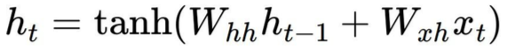
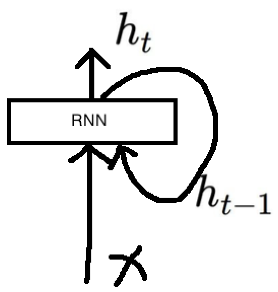
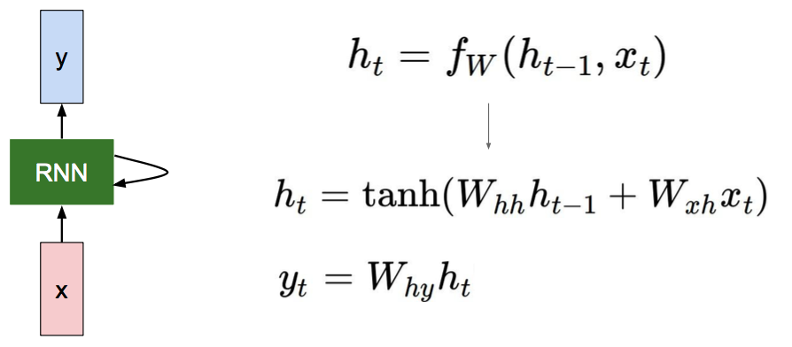
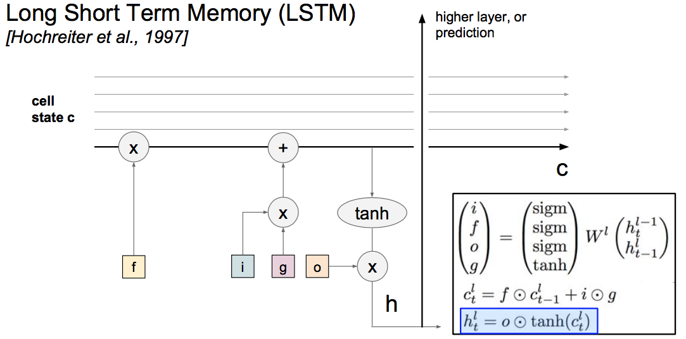

# L10: Recurrent Neural Networks

## 1. Vanilla RNN layer

RNN的关键就在于会把之前的信息保留下来，很适合处理序列。Rnn层如下：

一个RNN层和一个输出层的network

## 2. Image Captioning

## 3. LSTM

RNN训练的时候容易出现梯度爆炸和梯度消失的问题，LSTM效果更好

LSTM的记忆性能RNN更好, f是forget gates。

## 4. Summary

