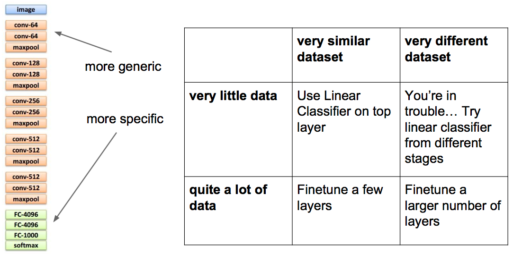
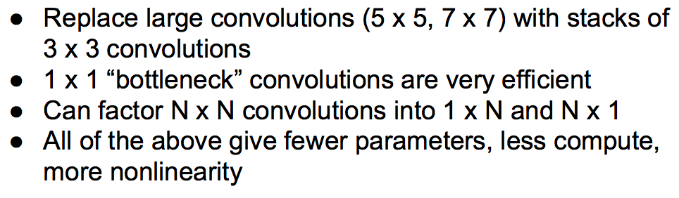
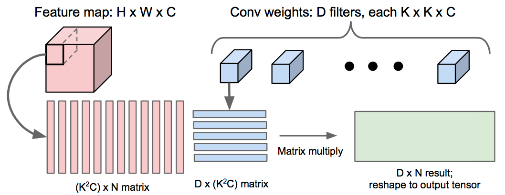
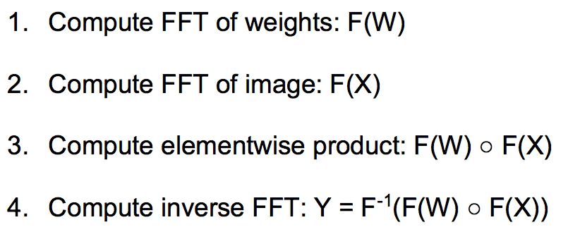

# L11: CNNs in practice

# 1. Making the most of your data

## 1.1 Data augmentation

1. Horizontal flips

2. Random crops/scales

3. Color jitter

4. 其他等等

## 1.2 Transfer learning

# 2. All about convolution

## 2.1 How to arrage them

有证明，小核深层比大核浅层效果好，而且省内存。

## 2.2 How to compute them fast

卷积运算有三种方法：

    im2col、FFT、Fast Algorithm

#### 2.2.1 im2col

把feature map和kernels转化成矩阵，通过矩阵相乘完成。 这种方法效率很高，易实现，也最常用。缺点是内存消耗大。

#### 2.2.2 FFT

把feature map和kernels用fft转化到频域，在频域相乘，再逆fft回来。

### 2.2.3 Fast Algorithm

这种方法比较复杂，没搞懂，也不是很常用。

