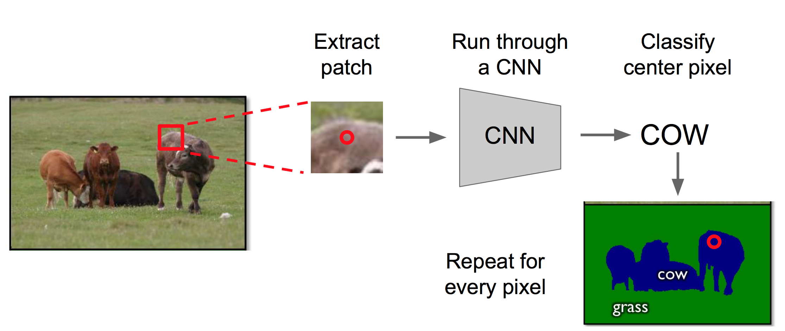
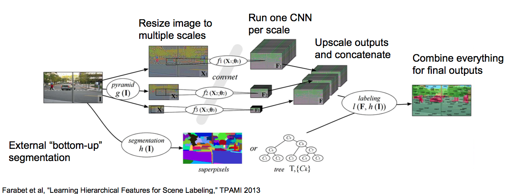
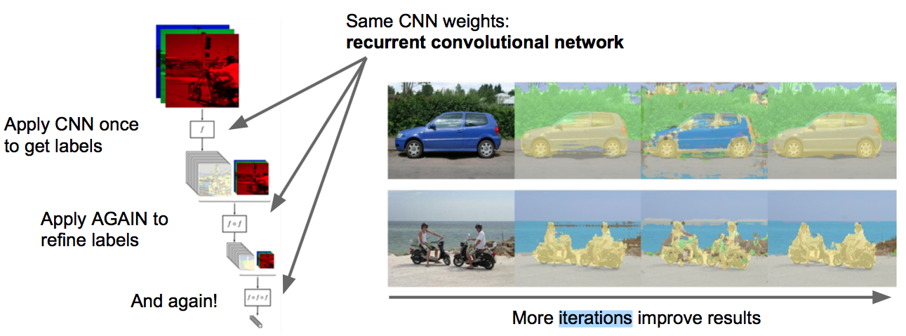
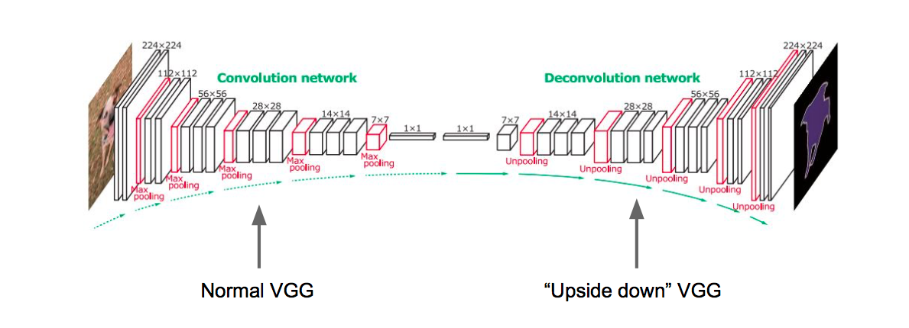
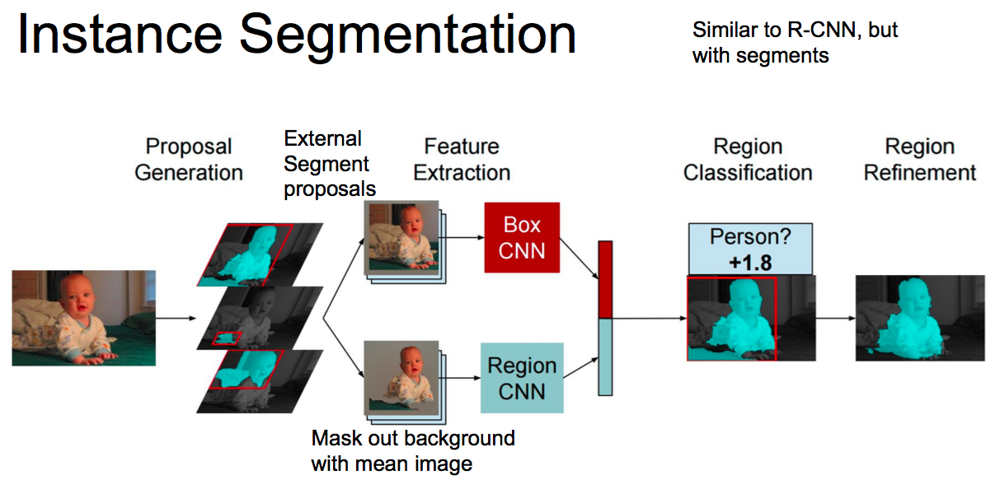
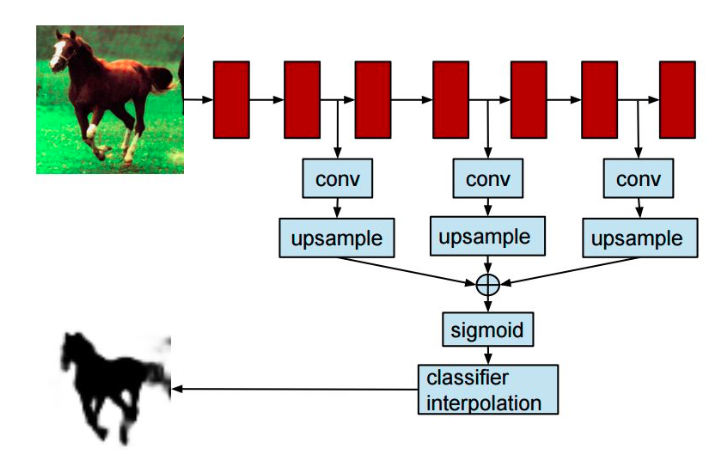
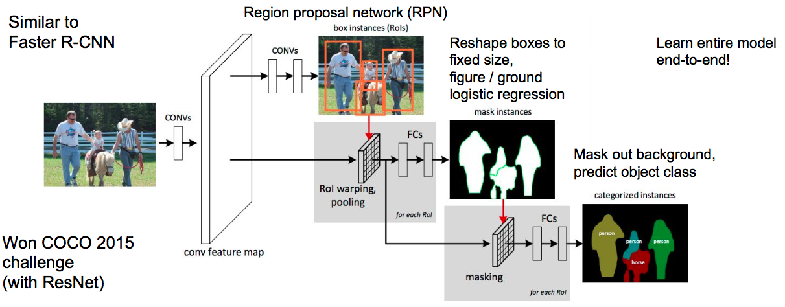
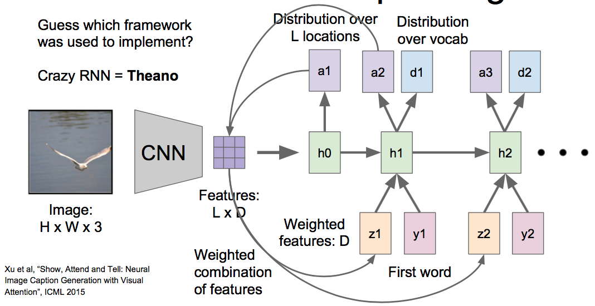
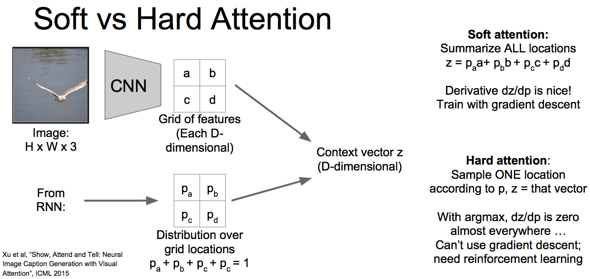
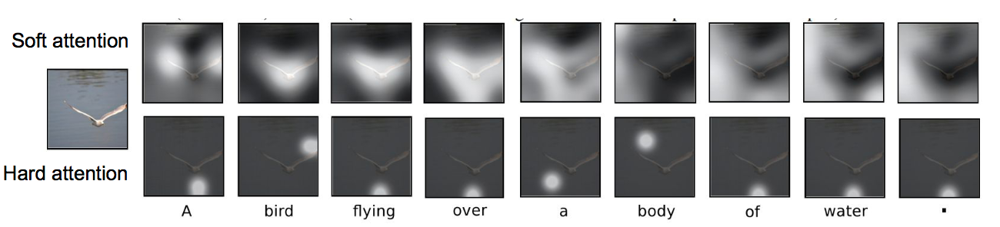

# L13: Segmentation and Attention

## 1. Segmentation

### 1.1 Semantic Segmentation

Label every pixel, but do not differentiate instances.

#### 1. Common Way by CNN

#### 2. Multi-Scale

Farbet et al, "Learning Hierarchical Features for Scene Labeling", TPAMI 2013

#### 3. refinement

Pinheiro and Collobert, "Recurrent Convolutional Neural Networks for Scene Labeling", ICML 2014

方法和"Common way by cnn"类似，不同之处就是每次判断一个pixel的分类的时候是用多次迭代是用CNN.

#### 4. Upsampling

通过Deconvolution实现

Noh et al, “Learning Deconvolution Network for Semantic Segmentation”, ICCV 2015

### 1.2 Instance Segmentation

Detect instances, give category, label

#### 1. Similar to R-CNN

Hariharan et al, “Simultaneous Detection and Segmentation”, ECCV 2014

#### 2. Hypercolumns

### 3. Cascades

### 1.3 Segmentation Overview

1. Semantic segmentation

    * classify all pixels
    * Fully convolutional models, downsample then upsample
    * Learnable upsampling: fractionally strided convolution
    * Skip connections can help

2. Instance Segmentation

    * Detect instance, generate mask
    * Similar pipeline to object detection

## 2. Attention

### 2.1 Discrete location

#### 1. soft attentation

a是一个权重分布矩阵，z相当于加权后的特征，起到了“注意不同位置”的效果。

#### 2. hard attentation

本课程里好像没介绍, 好像hard attentation不是用权重的方式，而是硬编码一块区域。

#### 3. soft vs hard

### 2.2 Continuous location (Spatial Transformers)
