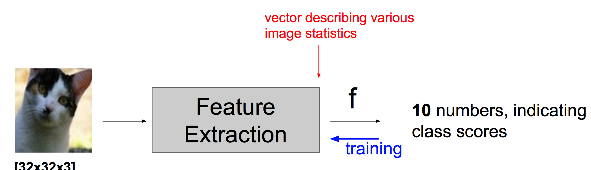
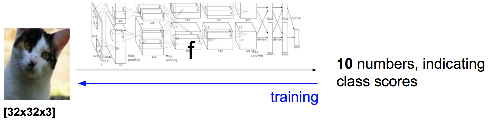

# L2: Image Classification Pipeline

## 0. Image Classification

We are given a Training Set of labeled images, asked to predict labels on Test Set. Common to report the Accuracy of predictions (fraction of correctly predicted images)

## 1. First Classifier: Nearest Neighbor Classifier

Predicts the labels based on nearest images in the training set

## 2. Tune Hiperparameters: Cross-validation

We saw that the choice of distance and the value of k are hyperparameters that are tuned using a validation set, or through cross-validation if the size of the data is small.

## 3. Linear Classification

### 3.1 linear classifier

formula:

    f(x, W, b) = W*x + b

### 3.2 Interpreting a Linear Classifier

W的每一行相当于这个分类的平均图像

## 4. Image Classfication Pipeline

traditional pipeline

deep learning pipeline

