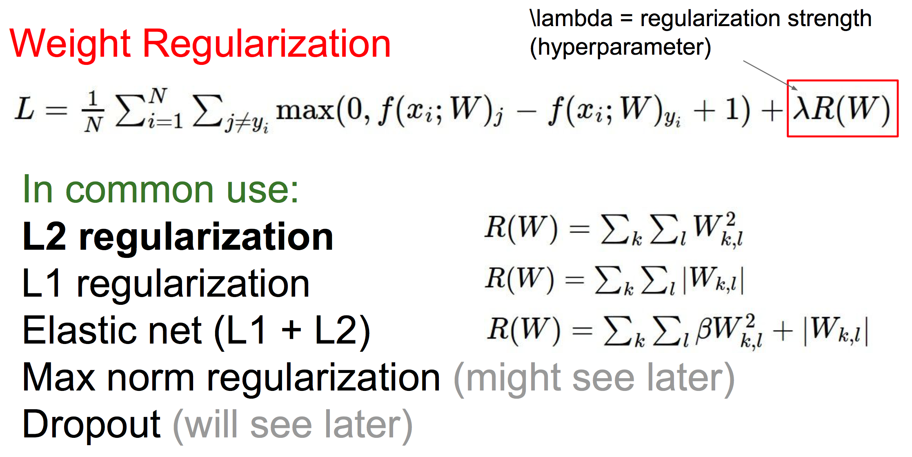

# L3: Loss Functions and Optimization


## 1. SVM loss

svm loss function:


with regularization:



加入regularization后，可以防止模型过于复杂，从而防止过拟合。因为过于复杂的参数在loss function中会受到惩罚。


## 2. Softmax loss

softmax function:


softmax loss function (cross-entropy loss):


## 3. Optimization: Mini-batch Gradient Descent

vanilla minibatch gradient descent:

```
while True:
    data_batch = sample_training_data(data, batch_size)
    weights_grad = evaluate_gradient(loss_function, data_batch, weights)
    weights += - step_size * weights_grad  # update formula

```

we will look at more fancy update formulas (momentum, Adagrad, RMSProp, Adam, ...)


## 4. Image Features

Color Histogram

HOG/SIFT features

Bag of Words


