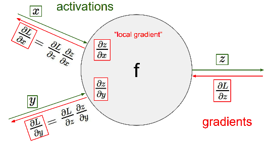
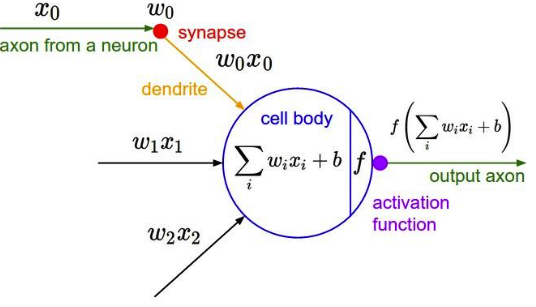
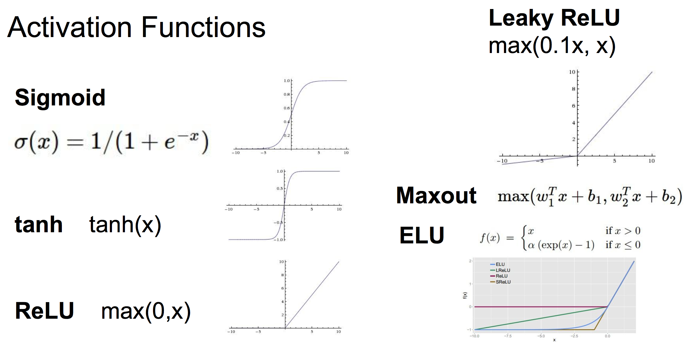

# L4 Backpropagation and Neural Networks part 1


## 1. Backpropagation



如果x是向量，梯度是一个Jacobian矩阵

如果分叉，则直接梯度相加

implementation:

```

class Multipy(object):
    '''
    - forward: compute result of an operation and save any intermediates needed for gradient computation in memory
    - backward: apply the chain rule to compute the gradient of the loss function with respect to the inputs.
    '''

    def forward(x1, x2):
        y = x1 * x2
        cache = (x1, x2, y)
        return y, cache

    def backward(dy, cache)
        x1, x2, y = cache
        dx1 = x2 * dy
        dx2 = x1 * dy
        return dx1, dx2
```

在Homework/assigment1/cs231n/classifiers/neural_net.py中可以看到两层fully_connected网络的代码。


## 2. Neural Networks

### 2.1 Neural Networks



Networks:

    f = W*x # 1-layer Networks
    f = W2*max(0, W1*x)  # 2-layer network


### 2.2 Activation Function

sigmoid function:



实际经验：

    - 一般使用ReLU, 注意调好学习率
    - 可以尝试Leaky ReLU / Maxout /ELU
    - 可以尝试 tanh， 但是不要期望有很好的效果
    - 不要用sigmoid! 不要用sigmoid! 不要用sigmoid!


    