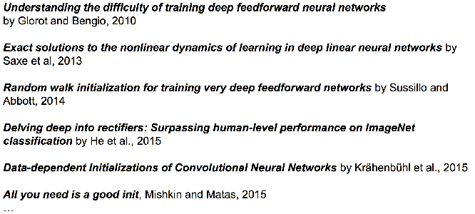
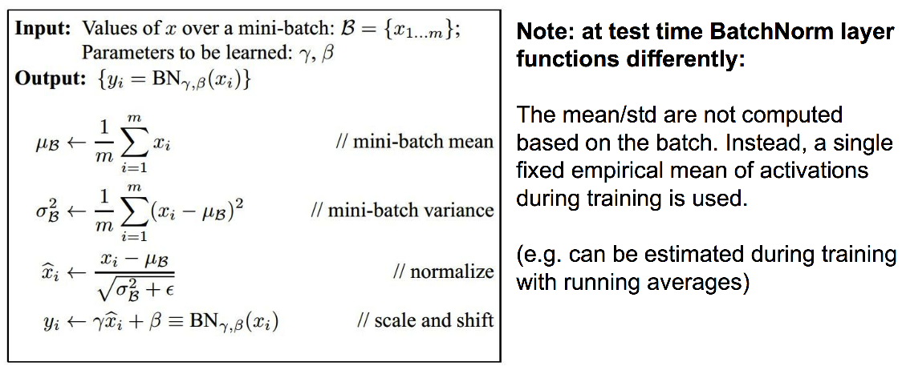

# L5: Training Neural Networks Part1

## 1. Data Preprocessing

Normalize data

    X -= np.mean(X, axis=0)
    X /= np.std(X, axis=0)

图像中，经常将一张图片减去平均图片作为输入

## 2. Parameters Initialization

### 2.1 Small random numbers

用小标准差的，均值为0的高斯分布初始化：

    W = 0.01 * np.random.randn(D, H)

这种方法对于深度小的网络起作用，但是一旦网络深了以后，容易使很多单元不激活（Dead)

### 2.2 其他方法

参数初始化是一个研究领域，有许多相关研究

## 3. Batch Normalization

Batch Normalization层可以有效提高网络的准确度。

Batch Normalization在训练和测试的时候获取均值和标准差的方法不同，训练的时候用mini-batch计算，并保留下来。测试的时候用保留下来的值。

## 4. Hyperparameter Optimization

random sample hyperparams, in log space when appropriate.

