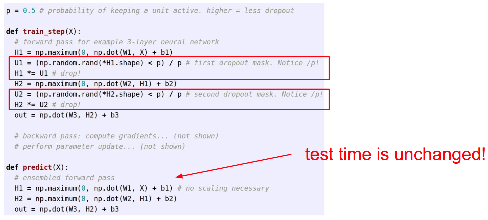

# L6: Training Neural Networks part 2


## 1. Mini-batch SGD

伪代码：

    Loop:
        1. Sample a batch of data
        2. Forward prop it through the graph, get loss
        3. Backprop to calculate the gradients
        4. Update the parameters using the gradint


## 2. Parameter Update

### 2.1 Momentum update:

引入惯性的思想

```
v = mu * v - learning_rate *dx
x += v
```

mu是惯性系数，大约通常取0.5, 0.9, or 0.99


### 2.2 Nesterov Momentum update

比Momentum update超前一步

```
v_prev = v
v = mu*v - learning_rate * dx
x += -mu*v_prev + (1 + mu) * v
```

### 2.3 AdaGrad update

相当于可变步长

```
cache += dx**2
x += - lrarning_rate * dx / (np.sqrt(cache) + 1e-7)
```

### 2.4 RMSProp update

AdaGrad的改进

```
cache += dacay_rate*cache + (1 - decay_rate)*dx**2
x += - lrarning_rate * dx / (np.sqrt(cache) + 1e-7)
```
decay_rate取值0～1


### 2.5 Adam update

综合了以上各种优点，最常用，目前效果最好。既有mumtenum，也有步长积累。

```
m = beta1*m + (1 - beta1) * dx
cache = beta2*cache + (1 - beta2)*(dx**2)
m_b = m / (1 - beta1**t)  # correct bias
cache_b = cache / (1 - beta2**t)  # correct bias
x += - learning_rate * m / (np.sqrt(cache) + 1e-7)
```

correct bias机制可以防止刚启动时步长较小的问题，原话如下：

    The bias correction compensates for the fact that m,v are initialized at zero and need some time to “warm up”.

### 2.6 In Practice:

Adam is a good default choice in most cases


## 3. Dropout

Dropout也是一种regularization, 可以防止模型overfit

Dropout层在训练时随机屏蔽一些单元，在测试时相当于没有。




