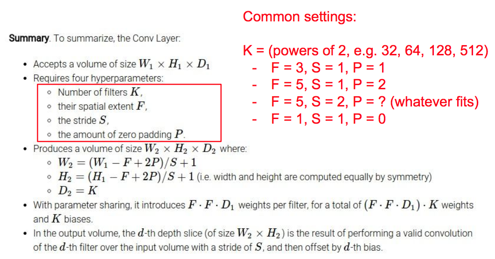
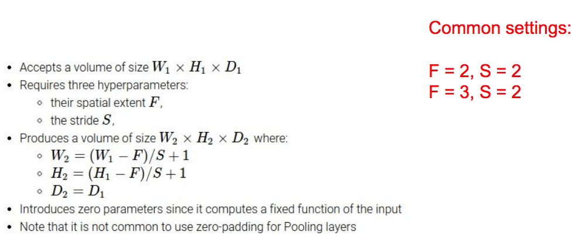
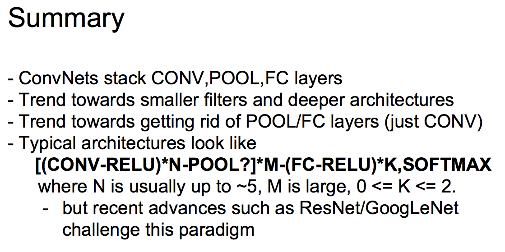

# L7: Convoluational Neural Networks

## 1. Convoluational Layer

本质就是两个思想：稀疏连接和共享参数

卷积的具体过程见可见，卷积后新的feature maps的维度如下：

## 2. Pooling Layer

就是一个采样层，最常用的是max pooling

## 3. 典型的CNN

一些出名的CNN

    LeNet:  最早的CNN，Yann LeCun，1990

    AlexNet: ImageNet 2012的冠军，Alex Krizhevsky， Hinton

    ZF Net: ILSVRC 2013 Winner

    GoogleNet:  ILSVRC 2014 winner, Google

    VGGNET: ILSVRC 2014 冠军侯选

    ResNet: ILSVRC 2015 winner，MSRA

## 4. 总结

