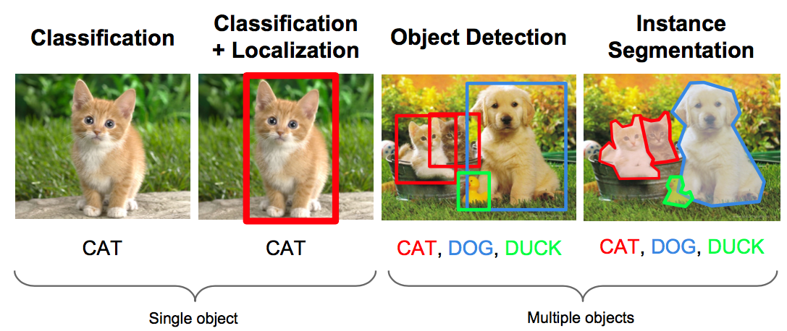
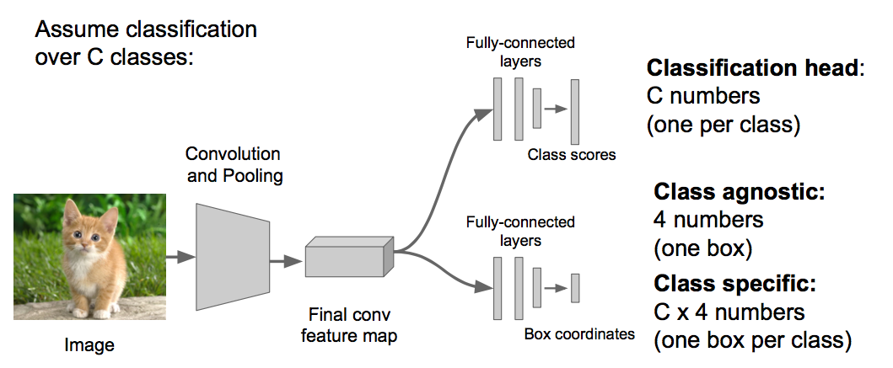
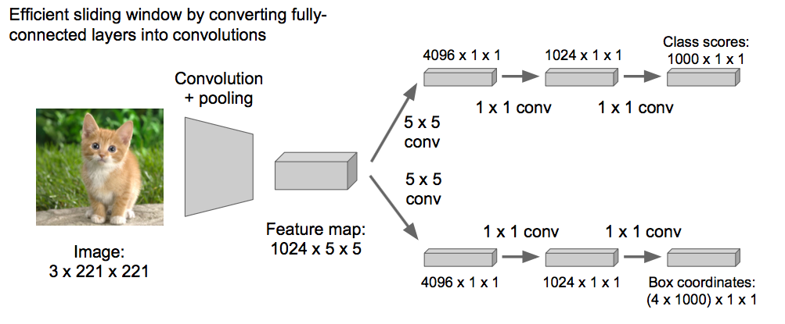
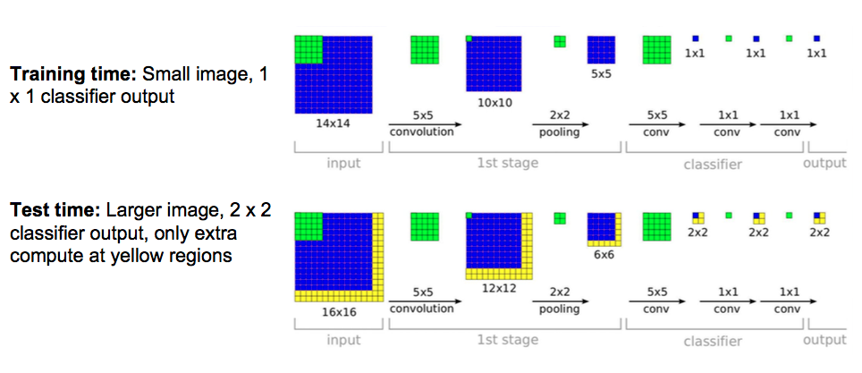
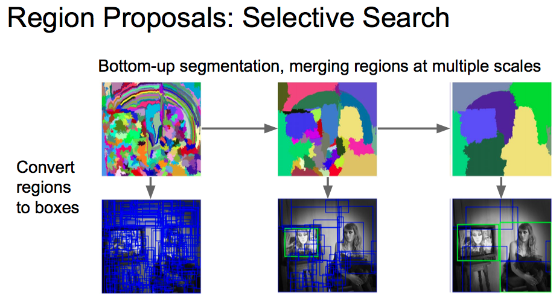
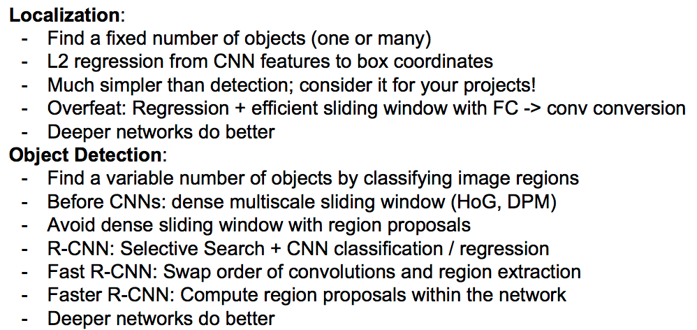

# L8: Spatial Localization and Detection

## 0. Computer Vision Tasks

## 1. Classification + Localization

Classification + Localization:

    input: image
    output: class label, box in the image (x, y, w, h)
    evaluation metric: Accuracy, Intersection over Union (IoU)

### 1.1 Idea1: Localization as Regression

### 1.2 Idea2: Sliding Windows: Overfeat

对于不同大小的图片，在idea1的基础上，对图片进行滑动窗口和尺寸金字塔，看哪个尺寸和位置的评分最高，以找到具体位置。

滑动窗口的思想，但是滑动窗口的效率太低，提高效率的方法是，把网络的全连接成变成卷积层替代，这样就可以输入不同尺寸的图片。

Sermanet et al, “Integrated Recognition, Localization and Detection using Convolutional Networks”, ICLR 2014

## 2. Object detection

### 2.1 传统方法：

    基于HOG特征（检测行人特别有效）： Dalal and Triggs, “Histograms of Oriented Gradients for Human Detection”, CVPR 2005 Slide credit: Ross Girshick

    Deformable Parts Model (DPM)：  Felzenszwalb et al, “Object Detection with Discriminatively Trained Part Based Models”, PAMI 2010

### 2.2 Region Proposals:

#### 2.2.1 Selective Search:

在多个尺度上对图像进行分割、合并，一副图被分割成很多部分，把每个部分都转化成方型，这一个个方型就是可能区域，对可能区域进行检测。这样极大地减少了搜索区域。

Uijlings et al, "Selective Search for Object Recognition", IJCV 2013

#### 2.2.2 其他Region Proposals的方法

这里有一篇关于Region Proposals的综述，总结了很多选取Proposals的方法，并做了对比。

    Hosang et al, "What makes for effective detection proposals?", PAMI 2015

#### 2.2.3 R-CNN

R-CNN：

    Girschick et al, “Rich feature hierarchies for accurate object detection and semantic segmentation”, CVPR 2014

Fast R-CNN:

    Ross Girshick, "Fast R-CNN", ICCV 2015

Faster R-CNN:

    Shaoqing Ren, "Faster R-CNN: Towards Real-Time Object Detection with Region Proposal Networks", NIPS 2015

## 3. Object Detection: Evaluation

衡量物体检测准确度的指标：mean average precision (mAP)

    Mark Everingham， “The PASCAL Visual Object Classes (VOC) Challenge：

## 4. 总结

