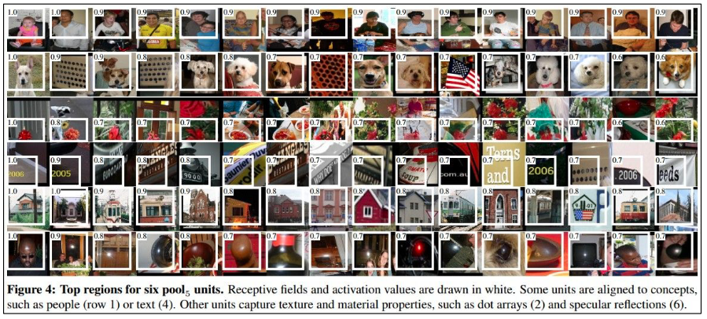
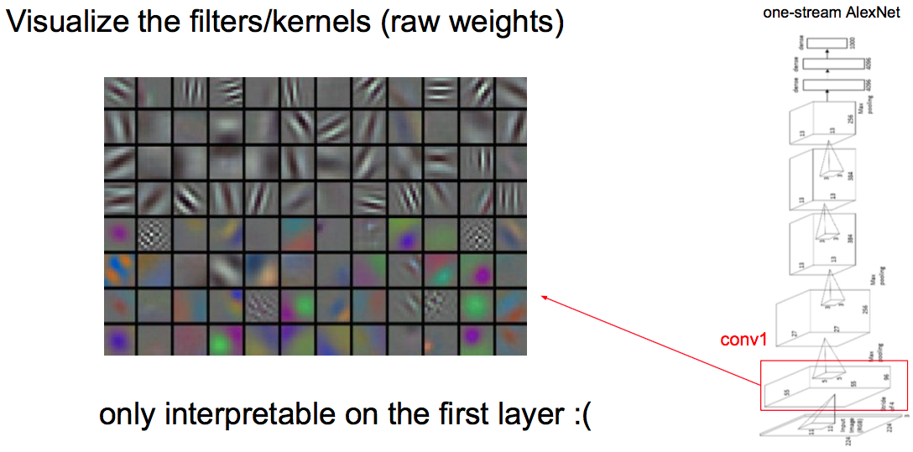
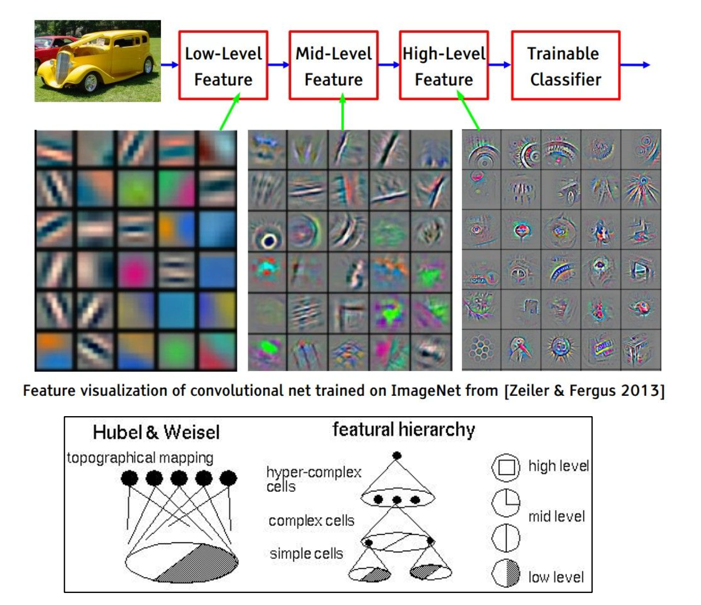
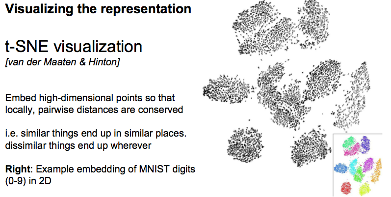
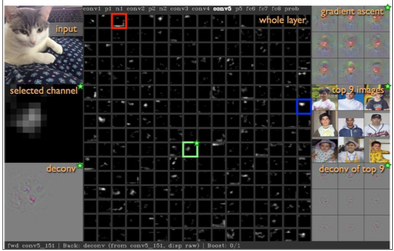
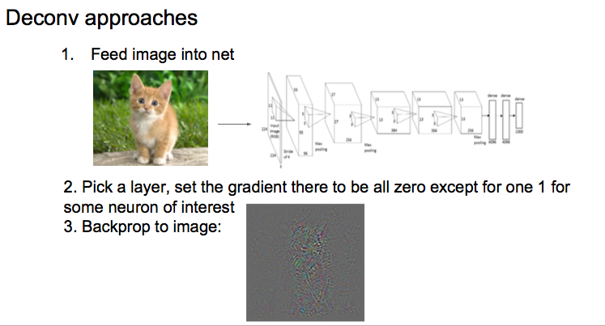
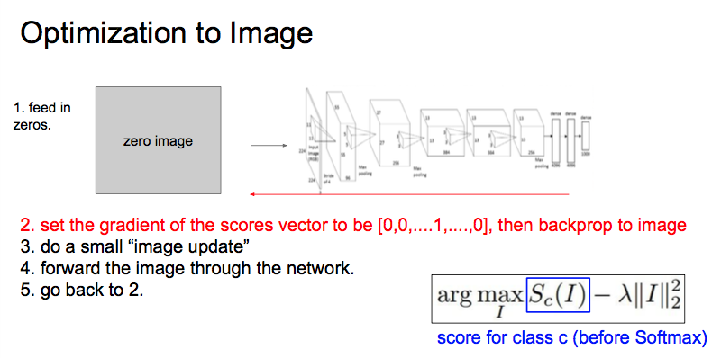
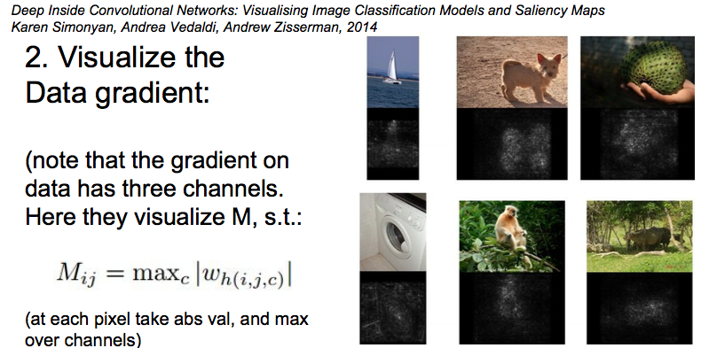
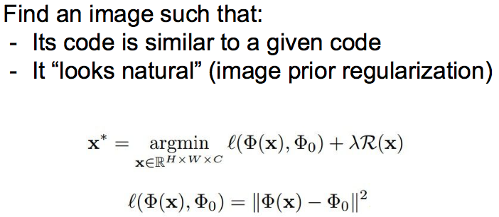
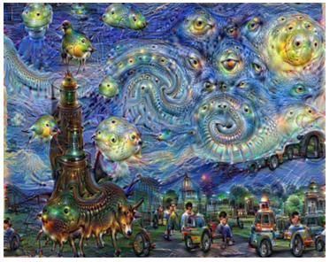

# L9: Understanding and Visualizing CNNs


## 1. Visualize patches that maximally activate neurons

选定一个要观察neurons，观察哪一个patches使的这个neurons的激发值最大。




## 2. Visualize Filters/Kernels raw weight

把卷机核显示出来，一般只有第一层的卷机核有明显的意义，之后的卷机核很难看出意义。




## 3. Viusalize Filters/Kernels by deconvolution

有一种把深度层卷机核意义表现出来的方法，叫"Deconvolution"。 就是把某一层的某个filers的响应逆回去变成图片，看一看这个filers是指图片中搜索什么特征。

具体步骤：把某一层某个filter形成的feature maps只保留一个neurons的值，其他全部为0, 然后deconvolution辉图片，观察这个filters是什么样的。




## 4. Visualize the representation

### 4.1 t-SNE visualization

这是一种把高纬度距离在二维平面上可视化的方法。

把许多图片用某一层的features map的特征表示出来，然后用t-SNE方法可时候出来，通常可视化某个fc层的特征。




## 5. Occlusion Experiments

用一个窗口遮挡不同部位，绘制出遮挡后的scores map。


## 6. Visualizing Activations by Deconvolution

###6.1 把features maps可视化出来。

输入一张图片，可视化出某层的feature map。



###6.2 Deconvolution查找某个activations的图片区域

输入一张图片，提取某个feature map中activation最大的neurons的点，其他点设为0，然后deconvolution回图片。




## 7. Optimization to Image

用梯度法找到一张图片使得某个class的scores最高



也可以对任意神经元做。

## 8. Visualize the data gradient

输入一张图片，back propagation得到这个图片的梯度图。



这种方法可以用来做图像分割。


## 9. Image reconstruction

寻找一张图片与已知某些feature maps值一样




## 10. DeepDream

改变输入图片，不断增强某一层的feature_map响应。

增强响应I = sum(0.5*x^2)，用backpropagation不断朝梯度方向修改原始图片。

将图片输入到CNN中，一直forward到某一要增强层，将这一层的feature map作为backward的输入，back回去得到增强图像的梯度方向，增强图像。

```
for i in range(iterations):
    feature_map, cache = cnn.forward(image, end=layer_num)
    dimage, _ = cnn.backward(feature_map, cache)
    image += learning_rate * dimage
```

这样就可以不断改变图片，从而增强layer_num层的feature_map响应，迭代次数可以设置。




## 11. 图像风格替换

```
# create a img_o with content of img_a and style of img_b
# input: img_a, img_b, alpha, beta，layer
# output: img_o

step 1: 把img_a输入到CNN中，得到第layer层的特征图f_a
step 2: 把img_b输入到CNN中，得到所有层的特征图f_b
step 3: 寻找一张最优图片使得如下目标函数最小，最优方法就用bp+梯度下降（同 9. Image reconstruction）
目标函数： min L_total(img_o) = alpha*L_content(f_a, img_o) + beta*L_style(f_b, img_o)
其中L_content和L_style可分别为内容距离函数和风格距离函数
```

具体见：A Neural Algorithm of Artistic Style by Leon A. Gatys, Alexander S. Ecker, and Matthias Bethge, 2015


## 12. 混淆图片

把图片朝着如下目标函数的正梯度方向修改：

    目标函数 L = 错误类的分数 - 正确类的分数

这样就可以把一张正确类的图片识别成错误类的图片。


